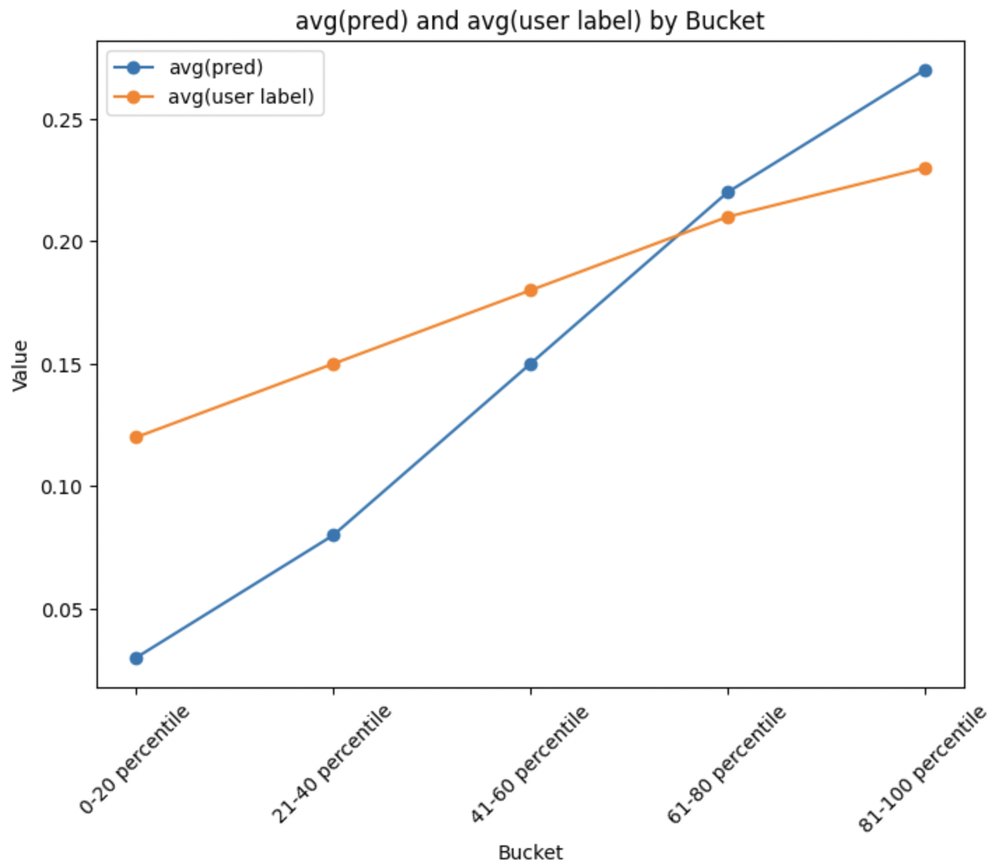

# calibration_arch_in_ranking_mtml
We show how to add a calibration arch to multi task multi-label models used in ranking of recommender systems.

# Problems
In recommender systems, we train a late stage ranking model for logistic loss along the multiple binary classification tasks that the model needs to predict. Even when models are trained on a lot of data, it might be the case that we encounter miscalibration of the following types:

## Overall calibration
This refers to cases where on a large enough eval dataset $\frac{avg(PredictedProbability)}{avg(UserActionLabel)}$ is much above or below 1. In ads recommender systems stacks, and often in feed blending stacks ensure calibration is a must. In other recsys it is often considered a good-to-have but not a must-have. Personally I believe calibration is important if your recsys uses a value model / [multi-task-fusion](https://arxiv.org/pdf/2208.04560) approach.

## Calibration on prediction buckets 
It is possible that model overpredicts or underpredicts at some ranges of the prediction. For instance if you make 5 equal buckets of the eval dataset based on the predicted labels and compare the average values of the predicted label and observed task, do you see some buckets where there is significant gap in prediction vs observation? e.g.

| bucket - percentile (pred) | avg(pred)  | avg(user label)  | absolute diff|
|-------------------|------------|------------------|--------------|
| 0-20 percentile   | 0.03       | 0.12             | 0.09 |
| 21-40 percentile  | 0.08       | 0.15             | 0.07 |
| 41-60 percentile  | 0.15       | 0.18             | 0.03 |
| 61-80 percentile  | 0.22       | 0.21             | 0.01 |
| 81-100 percentile | 0.27       | 0.23             | 0.04 |

In the example above, it is possible you don't observe much overall calibration error but you observe what is called expected calibration error. 
$$\sum_{i=1}^{5}|avg(PredictedProbability) - avg(UserActionLabel)|$$

## Feature based

In this we are given a feature which has categorical values. For instance, your might be overall calibrated but miscalibrated for users who come to your app less than 5 out of 30 days. Or it could be miscalibrated for items of certain type.

Examples:
1. You are training a "People you may know" friend recommendation unit in Facebook app. Say virtually 90%+ of the data is for users who have been on the app more than a month but you also want your model to do well for new users.

Approach:
1. Look at the rows in the batch that have this binary feature ~ 0 and 1 separately.
2. In each compute the mean values of the predicted probaility and the observed label.
3. Compute the mean squared error between mean(predicted) and mean(observed)

# Code overview

1. In [multi_task_estimator.py](./src/multi_task_estimator.py) we show a normal MTML without calibration constructs.
1. In [platt_scaling_calibration.py](./src/platt_scaling_calibration.py) we show an option of adding Platt Scaling to address OverAll Calibration.
1. In [prediction_buckets_calibration.py](./src/prediction_buckets_calibration.py) we try to reduce the second type of calibration error, miscalibration along prediction buckets.
1. In [feature_based_calibration.py](./src/feature_based_calibration.py) we measure miscalibration when the dataset is divided based on the categorical values of the specific feature. This tries to measure the calibration loss and provide gradient back.
1. In [feature_bias_capture.py](./src/feature_bias_capture.py) we approach the same feature based miscalibration slightly differently. We try to bring the feature all the way to the last layer and learn a logit bias for each of the T tasks. This can help to memorize and remove any uncaptured bias. For instance, if for your feature value = 1, for your task T1, you see that $\frac{avg(PredictedProbability(T1))}{avg(UserActionLabel(T1))}$ is 1.4, then the learned bias could capture ~ ln(1.4) ~ 0.336 . Hence after this addition, $\frac{avg(PredictedProbability(T1))}{avg(UserActionLabel(T1))}$ = 1.

# TBD
- Tests for platt scaling, feature bias and feature based calibration